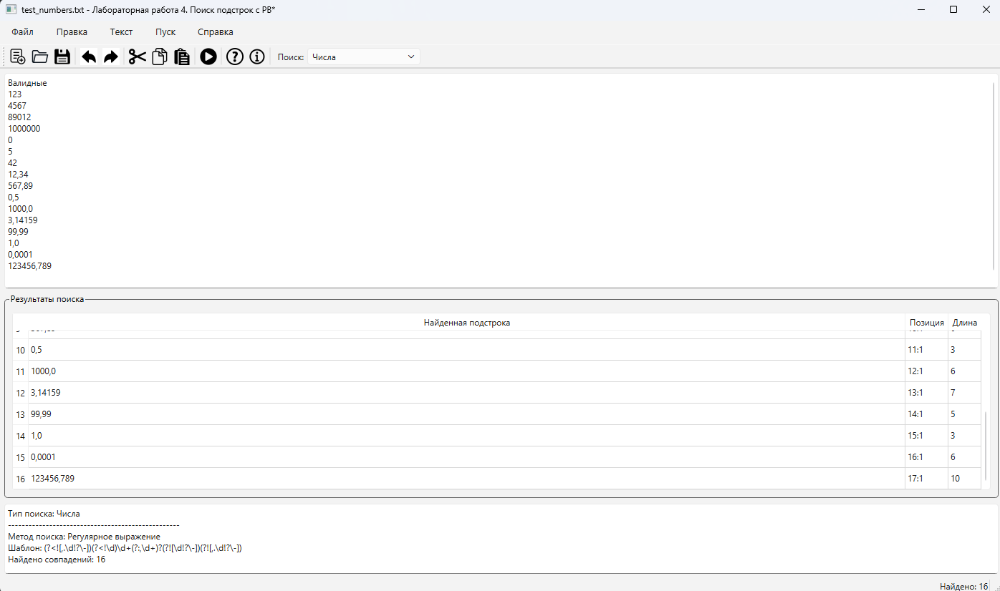
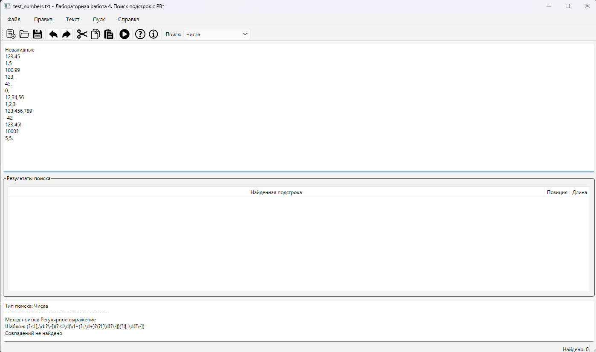
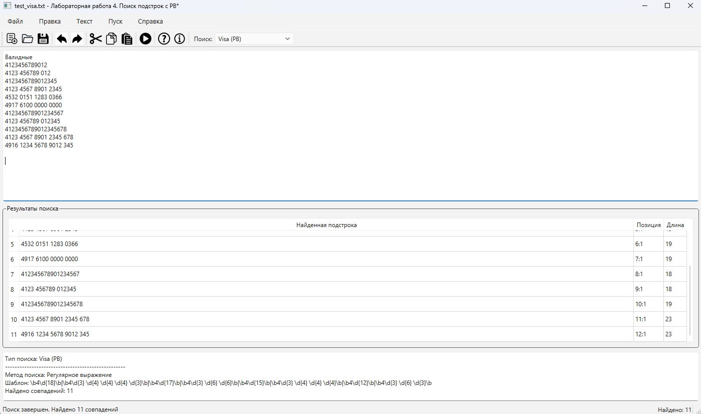
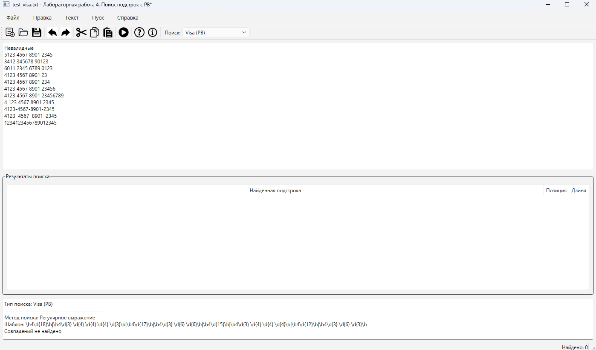
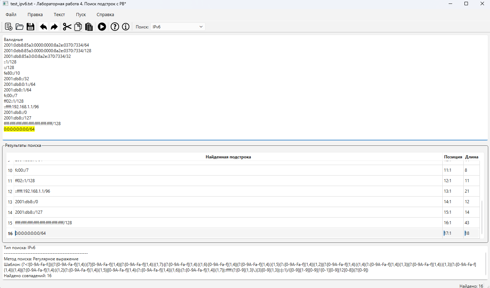
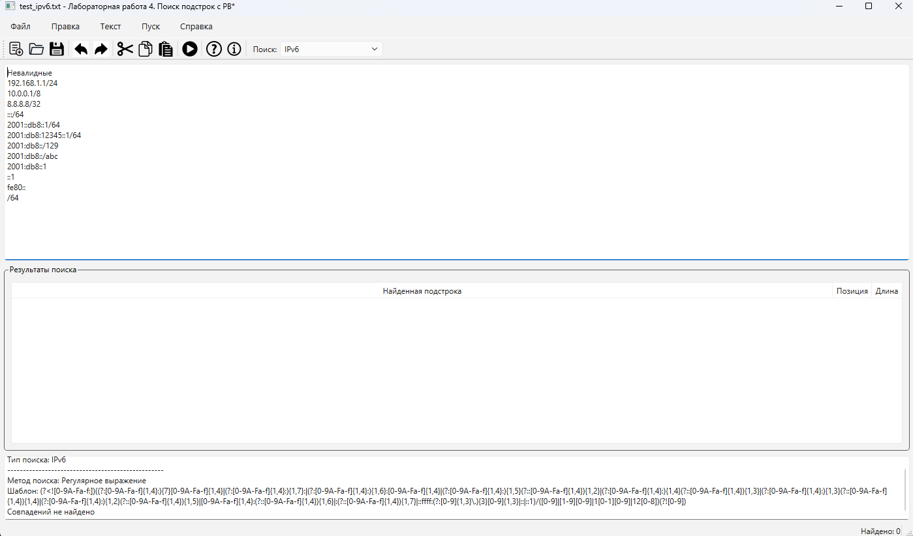
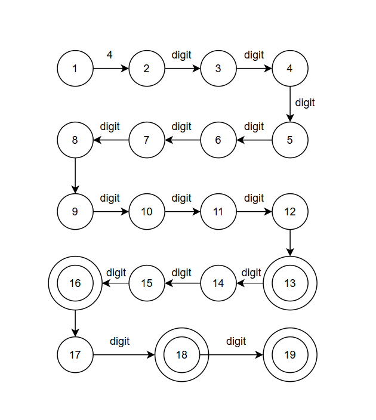
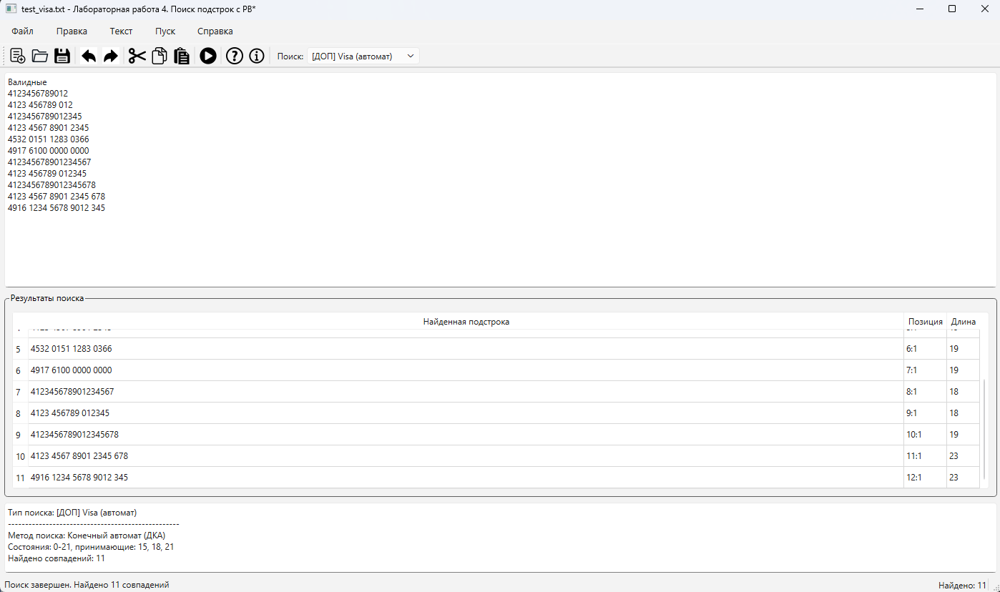

# Лабораторная работа №4: Реализация алгоритма поиска подстрок с помощью регулярных выражений

**Цель работы:** Изучить теоретические основы регулярных выражений и их применение для поиска и извлечения подстрок из текста. Освоить практические навыки использования библиотечных средств работы с регулярными выражениями, а также интеграцию алгоритмов поиска в графический интерфейс приложения.

## Сведения об авторе

| | |
|---|---|
| **Студент** | Топоев Максим |
| **Группа** | АП-327 |
| **Преподаватель** | Антонянц Егор Николаевич |
| **Год** | 2026 |

## Постановка задачи

Разработать модуль поиска подстрок с использованием регулярных выражений, интегрировать его в существующее приложение (текстовый редактор) и обеспечить наглядный вывод результатов.

**Требования к программе:**
- Интегрировать модуль поиска в существующий интерфейс текстового редактора
- Добавить элементы управления для выбора типа поиска
- Отображать результаты в таблице (подстрока, позиция, длина)
- Подсвечивать выбранное совпадение в тексте
- Выводить количество найденных совпадений

## Вариант задания

| Блок | Вариант | Описание |
|------|---------|----------|
| 1 | 21 | Числа: целые и с плавающей точкой (разделитель запятая) |
| 2 | 5 | Номера карт платежной системы Visa |
| 3 | 3 | IPv6 адрес с префиксом |

---

## Блок 1. Числа (целые и с плавающей точкой)

### Описание задачи
Построить регулярное выражение, описывающее целые числа и числа с плавающей точкой, где в качестве десятичного разделителя используется запятая.

### Регулярное выражение
`(?<![,.\d!?-])(?<!\d)\d+(?:,\d+)?(?![\d!?-])(?![,.\d!?-])`

### Пояснение обозначений

| Символ | Значение |
|--------|----------|
| `(?<![,.\d!?\-])` | Негативный просмотр назад: перед числом не должно быть `,` `.` `!` `?` `-` или цифры |
| `(?<!\d)` | Дополнительная проверка: перед числом не цифра |
| `\d+` | Одна или более цифр (целая часть) |
| `(?:,\d+)?` | Необязательная группа: запятая и одна или более цифр (дробная часть) |
| `(?![\d!?\-])` | Негативный просмотр вперед: после числа не должно быть цифры, `!`, `?`, `-` |
| `(?![,.\d!?\-])` | Дополнительная проверка: после числа не должно быть `,` `.` `!` `?` `-` или цифры |

### Примеры строк, которые должны находиться

123  
4567  
89012  
1000000  
0  
5  
42  
12,34  
567,89  
0,5  
1000,0  
3,14159  
99,99

### Примеры строк, которые не должны находиться

123.45  
1.5  
100.99  
123,  
45,  
12,34,56  
1,2,3  
123,456,789  
-42  
123,45!  
1000?  
5,5.

### Тестовые примеры

 Рисунок 1 - Примеры строк, которые должны находиться

Рисунок 2 - Примеры строк, которые не должны находиться

## Блок 2. Номера карт Visa

### Описание задачи
Построить регулярное выражение для поиска номеров карт, принадлежащих платежной системе Visa. Номера карт Visa начинаются с цифры 4 и имеют длину 13, 16, 18 или 19 цифр. Допускается формат с пробелами между группами цифр.

### Форматы номеров Visa

| Длина | Слитно | С пробелами |
|-------|--------|-------------|
| 13 цифр | `4123456789012` | `4123 456789 012` |
| 16 цифр | `4123456789012345` | `4123 4567 8901 2345` |
| 18 цифр | `412345678901234567` | `4123 456789 012345` |
| 19 цифр | `4123456789012345678` | `4123 4567 8901 2345 678` |

### Регулярное выражение

\b4\d{18}\b|\b4\d{3} \d{4} \d{4} \d{4} \d{3}\b|\b4\d{17}\b|\b4\d{3} \d{6}   
\d{6}\b|\b4\d{15}\b|\b4\d{3} \d{4} \d{4} \d{4}\b|\b4\d{12}\b|\b4\d{3} \d{6} \d{3}\b

### Пояснение обозначений

| Символ | Значение |
|--------|----------|
| `\b` | Граница слова |
| `4` | Первая цифра (все карты Visa начинаются с 4) |
| `\d{12}` | Ровно 12 цифр (для 13-значных слитно) |
| `\d{15}` | Ровно 15 цифр (для 16-значных слитно) |
| `\d{17}` | Ровно 17 цифр (для 18-значных слитно) |
| `\d{18}` | Ровно 18 цифр (для 19-значных слитно) |
| `\d{3} \d{6} \d{3}` | Формат с пробелами для 13 цифр |
| `\d{3} \d{4} \d{4} \d{4}` | Формат с пробелами для 16 цифр |
| `\d{3} \d{6} \d{6}` | Формат с пробелами для 18 цифр |
| `\d{3} \d{4} \d{4} \d{4} \d{3}` | Формат с пробелами для 19 цифр |
| `\|` | Логическое ИЛИ (альтернатива) |

### Примеры строк, которые должны находиться

4123456789012  
4123 456789 012  
4123456789012345  
4123 4567 8901 2345  
4532 0151 1283 0366  
4917 6100 0000 0000  
412345678901234567  
4123 456789 012345  
4123456789012345678  
4123 4567 8901 2345 678  
4916 1234 5678 9012 345  

### Примеры строк, которые не должны находиться

5123 4567 8901 2345  
3412 345678 90123  
6011 2345 6789 0123  
4123 4567 8901 23  
4123 4567 8901 234  
4123 4567 8901 23456  
4 123 4567 8901 2345  
4123-4567-8901-2345  
4123 4567 8901 2345  
1234123456789012345  

### Тестовые примеры

Рисунок 3 – Примеры строк, которые должны находиться

Рисунок 4 – Примеры строк, которые не должны находиться

## Блок 3. IPv6 адрес с префиксом

### Описание задачи
Построить регулярное выражение, описывающее IPv6 адрес с префиксом. IPv6 адрес состоит из 8 групп шестнадцатеричных цифр, разделенных двоеточиями, с возможностью сжатия нулей (`::`). После адреса указывается префикс в формате `/число`, где число от 0 до 128.

### Регулярное выражение

(?<![0-9A-Fa-f:])((?:[0-9A-Fa-f]{1,4}:){7}[0-9A-Fa-f]{1,4}|  
(?:[0-9A-Fa-f]{1,4}:){1,7}:|  
(?:[0-9A-Fa-f]{1,4}:){1,6}:[0-9A-Fa-f]{1,4}|  
(?:[0-9A-Fa-f]{1,4}:){1,5}(?::[0-9A-Fa-f]{1,4}){1,2}|  
(?:[0-9A-Fa-f]{1,4}:){1,4}(?::[0-9A-Fa-f]{1,4}){1,3}|  
(?:[0-9A-Fa-f]{1,4}:){1,3}(?::[0-9A-Fa-f]{1,4}){1,4}|  
(?:[0-9A-Fa-f]{1,4}:){1,2}(?::[0-9A-Fa-f]{1,4}){1,5}|  
[0-9A-Fa-f]{1,4}:(?::[0-9A-Fa-f]{1,4}){1,6}|  
:(?::[0-9A-Fa-f]{1,4}){1,7}|  
::ffff:(?:[0-9]{1,3}.){3}[0-9]{1,3}|  
::|  
::1)/([0-9]|  
[1-9][0-9]|  
1[0-1][0-9]|  
12[0-8])(?![0-9])

### Пояснение обозначений

| Символ | Значение |
|--------|----------|
| `(?<![0-9A-Fa-f:])` | Негативный просмотр назад: перед адресом не должно быть шестнадцатеричных цифр или двоеточия |
| `(?:[0-9A-Fa-f]{1,4}:){7}[0-9A-Fa-f]{1,4}` | Полный формат: 8 групп по 1-4 шестнадцатеричные цифры |
| `(?:[0-9A-Fa-f]{1,4}:){1,7}:` | Сжатие нулей в конце (например, `2001:db8::`) |
| `(?:[0-9A-Fa-f]{1,4}:){1,6}:[0-9A-Fa-f]{1,4}` | Сжатие нулей в середине |
| `::ffff:(?:[0-9]{1,3}\.){3}[0-9]{1,3}` | IPv4-mapped IPv6 адрес |
| `::` | Неопределенный адрес |
| `::1` | Loopback адрес |
| `/([0-9]\|[1-9][0-9]\|1[0-1][0-9]\|12[0-8])` | Префикс от 0 до 128 |
| `(?![0-9])` | Негативный просмотр вперед: после префикса не должно быть цифры |

### Примеры строк, которые должны находиться

2001:0db8:85a3:0000:0000:8a2e:0370:7334/64  
2001:db8:85a3:0:0:8a2e:370:7334/32  
::1/128  
::/128  
fe80::/10  
2001:db8::/32  
2001:db8:0:1::/64  
fc00::/7  
ff02::1/128  
::ffff:192.168.1.1/96  
ffff:ffff:ffff:ffff:ffff:ffff:ffff:ffff/128  

### Примеры строк, которые не должны находиться

192.168.1.1/24   
10.0.0.1/8  
8.8.8.8/32  
:::/64  
2001::db8::1/64  
2001:db8:12345::1/64  
2001:db8::/129  
2001:db8::/abc  
2001:db8::1  
fe80::  
/64

### Тестовые примеры

Рисунок 5 – Примеры строк, которые должны находиться

Рисунок 6 – Примеры строк, которые не должны находиться

---

## Дополнительное задание

### Описание
Для задачи из 2 блока (номера карт Visa) реализован алгоритм поиска подстрок с использованием конечного автомата (ДКА).

### Граф автомата

Автомат для распознавания номеров карт Visa (13, 16, 18, 19 цифр, начинаются с 4). Пробелы игнорируются — автомат остается в том же состоянии.

### Тестовые примеры

Рисунок 7 – Граф автомата

Рисунок 8 – Тестовые примеры работы автомата