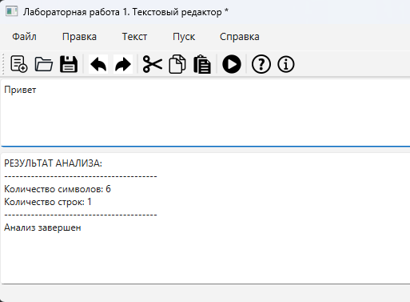

# Лабораторная работа 1: Разработка GUI для языкового процессора

## Сведения об авторе
- **Студент:** Топоев Максим
- **Группа:** АП-327
- **Преподаватель:** Антонянц Егор Николаевич, ассистент каф. АСУ
- **Год:** 2026

## Цель работы
Создание кроссплатформенного графического интерфейса (GUI) для языкового процессора в виде специализированного текстового редактора.

## Описание проекта
Данное приложение представляет собой базовый текстовый редактор, который является основой для будущего языкового процессора. Редактор обладает полным функционалом работы с файлами, редактирования текста, а также содержит область вывода для отображения результатов анализа кода.

## Используемые технологии
- **Язык программирования:** Python 3.12
- **Фреймворк для GUI:** PyQt6
- **Среда разработки:** PyCharm
- **Инструмент сборки:** PyInstaller

## Инструкция по сборке и запуску

### Запуск из исходного кода
1. Установить Python 3.8+
2. Установить зависимости:
   ```bash
   pip install PyQt6
3. Запустить программу:
   `python main.py`

### Создание исполняемого файла (EXE)
1. Установить PyInstaller
   `pip install pyinstaller`
2. Собрать проект:
   `pyinstaller --onefile --windowed --name "TextEditor" main.py`
3. Готовый файл находится в папке **dist/TextEditor.exe**

## Описание интерфейса и фукнций (руководство пользователя)

### Реализованный функционал

#### Меню "Файл"
| Функция | Горячая клавиша | Описание |
|---------|-----------------|----------|
| Создать | Ctrl+N | Создать новый файл |
| Открыть | Ctrl+O | Открыть существующий файл |
| Сохранить | Ctrl+S | Сохранить изменения |
| Сохранить как | Ctrl+Shift+S | Сохранить в новый файл |
| Выход | Ctrl+Q | Выход из программы (с подтверждением) |

#### Меню "Правка"
| Функция | Горячая клавиша | Описание |
|---------|-----------------|----------|
| Отмена | Ctrl+Z | Отменить последнее действие |
| Повторить | Ctrl+Y | Повторить отмененное действие |
| Вырезать | Ctrl+X | Вырезать выделенный текст |
| Копировать | Ctrl+C | Копировать выделенный текст |
| Вставить | Ctrl+V | Вставить текст из буфера |
| Удалить | Del | Удалить выделенный текст |
| Выделить все | Ctrl+A | Выделить весь текст |

#### Меню "Текст" (заготовки)
- Постановка задачи
- Грамматика
- Классификация грамматики
- Метод анализа
- Тестовый пример
- Список литературы
- Исходный код программы

#### Меню "Пуск"
- **Запуск анализатора (F5)** - демонстрационный анализ текста (подсчет символов и строк)

#### Меню "Справка"
- **Вызов справки (F1)** - руководство пользователя
- **О программе** - информация об авторе

#### Панель инструментов
Содержит кнопки для быстрого доступа ко всем основным функциям программы:
- Создать, Открыть, Сохранить
- Отменить, Повторить
- Вырезать, Копировать, Вставить
- Пуск
- Справка, О программе

### Особенности реализации
- **Изменение размеров областей** - можно перетаскивать границу между редактором и областью вывода
- **Диалог подтверждения** - при попытке закрыть несохраненный файл
- **Строка состояния** - отображает текущий статус программы

### Скриншоты

#### Главное меню


Основное меню программы с такими элементами как:
- Элементы меню
- Панель управления
- Область ввода текста
- Область вывода результата

#### Меню "Файл"


Каждый элемент меню, помимо Пуска, можно развернуть, наведя курсор. Откроется список функций с их "горячими" клавишами.


#### Работа анализатора


На данный момент, реализована временная работа анализатора - считается количество символов и строк во введенном тексте.
Запуск происходит по нажатии на пункт меню "Пуск", того же пункта на панели управления и по нажатии клавиши F5.


## Ограничения
- Меню "Текст" содержит заглушки (будут реализованы в следующих лабораторных работах)
- Анализатор работает в демонстрационном режиме (только подсчет символов и строк)
- Подсветка синтаксиса не реализована
- Программа протестирована только на ОС Windows 10/11
- Для работы иконок необходима папка `icons` с PNG файлами