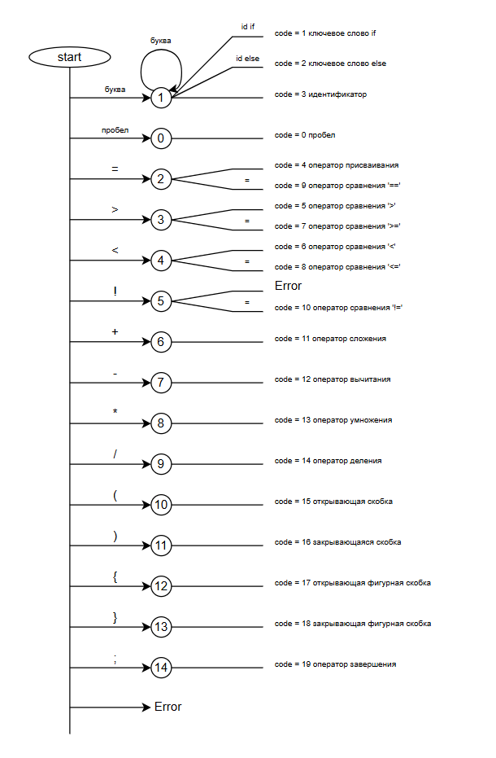
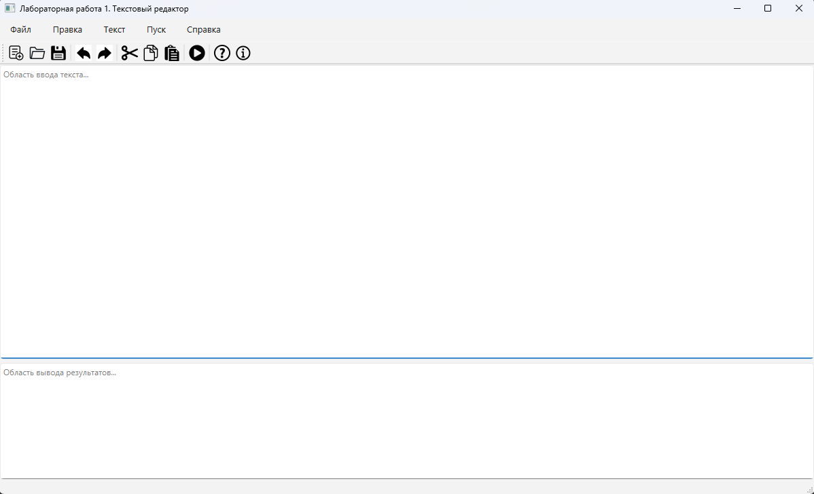
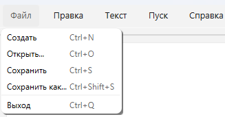
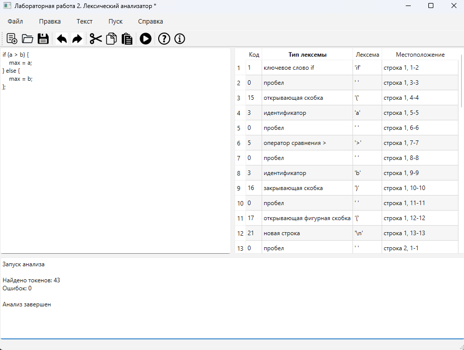

# Лабораторная работа 2: Разработка лексического анализатора (сканера)

## Сведения об авторе
- **Студент:** Топоев Максим
- **Группа:** АП-327
- **Преподаватель:** Антонянц Егор Николаевич, ассистент каф. АСУ
- **Год:** 2026

## Цель работы
Изучить назначение и принципы работы лексического анализатора в структуре компилятора. Спроектировать алгоритм (диаграмму состояний) и выполнить программную реализацию сканера для выделения лексем из входного текста. Интегрировать разработанный модуль в ранее созданный графический интерфейс языкового процессора.

## Описание проекта
Данное приложение представляет собой текстовый редактор с интегрированным лексическим анализатором для Java-подобного языка. На текущем этапе реализована полная функциональность распознавания основных лексем: ключевых слов if и else, идентификаторов, оператора присваивания, операторов сравнения, арифметических операторов, скобок, точки с запятой, а также пробельных символов. Результаты лексического анализа выводятся в таблицу, содержащую числовой код лексемы, текстовое описание типа, выделенную лексему и её местоположение в тексте с указанием строки и позиций символов. Приложение сохраняет весь функционал текстового редактора из лабораторной работы №1, включая создание, открытие и сохранение файлов, редактирование текста, меню "Правка" со стандартными операциями, панель инструментов и справочную систему.

## Используемые технологии
- **Язык программирования:** Python 3.12
- **Фреймворк для GUI:** PyQt6
- **Среда разработки:** PyCharm
- **Инструмент сборки:** PyInstaller

## Инструкция по сборке и запуску

### Запуск из исходного кода
1. Установить Python 3.8+
2. Установить зависимости:
   ```bash
   pip install PyQt6
3. Запустить программу:
   `python main.py`

### Создание исполняемого файла (EXE)
1. Установить PyInstaller
   `pip install pyinstaller`
2. Собрать проект:
   `pyinstaller --onefile --name "TextEditor" main.py`
3. Готовый файл находится в папке **dist/TextEditor.exe**

## Описание интерфейса и фукнций (руководство пользователя)

### Реализованный функционал

#### Меню "Файл"
| Функция       | Горячая клавиша | Описание                              |
|---------------|-----------------|---------------------------------------|
| Создать       |  Ctrl+N         | Создать новый файл                    |
| Открыть       | Ctrl+O          | Открыть существующий файл             |
| Сохранить     | Ctrl+S          | Сохранить изменения                   |
| Сохранить как | Ctrl+Shift+S    | Сохранить в новый файл                |
| Выход         | Ctrl+Q          | Выход из программы (с подтверждением) |

#### Меню "Правка"
| Функция      | Горячая клавиша | Описание                      |
|--------------|-----------------|-------------------------------|
| Отмена       | Ctrl+Z          | Отменить последнее действие   |
| Повторить    | Ctrl+Y          | Повторить отмененное действие |
| Вырезать     | Ctrl+X          | Вырезать выделенный текст     |
| Копировать   | Ctrl+C          | Копировать выделенный текст   |
| Вставить     | Ctrl+V          | Вставить текст из буфера      |
| Удалить      | Del             | Удалить выделенный текст      |
| Выделить все | Ctrl+A          | Выделить весь текст           |

#### Меню "Текст" (заготовки)
- Постановка задачи
- Грамматика
- Классификация грамматики
- Метод анализа
- Тестовый пример
- Список литературы
- Исходный код программы

#### Меню "Пуск"
- **Запуск анализатора (F5)** - выполняет лексический анализ текста и выводит результаты в таблицу

#### Меню "Справка"
- **Вызов справки (F1)** - руководство пользователя
- **О программе** - информация об авторе

#### Панель инструментов
Содержит кнопки для быстрого доступа ко всем основным функциям программы:
- Создать, Открыть, Сохранить
- Отменить, Повторить
- Вырезать, Копировать, Вставить
- Пуск
- Справка, О программе

### Особенности реализации
- **Изменение размеров областей** - можно перетаскивать границу между редактором и областью вывода
- **Диалог подтверждения** - при попытке закрыть несохраненный файл
- **Строка состояния** - отображает текущий статус программы

### Новое в лабораторной работе №2
#### Интерфейс
Таблица результатов - добавлена справа от редактора для отображения найденных лексем и содержит 4 колонки:
- Код - числовой идентификатор типа лексемы
- Тип лексемы - текстовое описание
- Лексема - выделенная подстрока (в кавычках)
- Местоположение - строка и позиции символов

Лексический анализатор
На данном этапе добавлены все операторы и разделители:

| Код  | Тип лексемы                 | Описание                                     |
|------|-----------------------------|----------------------------------------------|
| 0    | пробел                      | Пробельный символ ' '                        |
| 1    | ключевое слово if           | Ключевое слово `if`                          |
| 2    | ключевое слово else         | Ключевое слово `else`                        |
| 3    | идентификатор               | Имя переменной (буквы, цифры, подчеркивание) |
| 4    | оператор присваивания       | `=`                                          |
| 5    | оператор сравнения          | `>`                                          |
| 6    | оператор сравнения          | `<`                                          |
| 7    | оператор сравнения          | `>=`                                         |
| 8    | оператор сравнения          | `<=`                                         |
| 9    | оператор сравнения          | `==`                                         |
| 10   | оператор сравнения          | `!=`                                         |
| 11   | арифметический оператор     | `+`                                          |
| 12   | арифметический оператор     | `-`                                          |
| 13   | арифметический оператор     | `*`                                          |
| 14   | арифметический оператор     | `/`                                          |
| 15   | открывающая скобка          | `(`                                          |
| 16   | закрывающая скобка          | `)`                                          |
| 17   | открывающая фигурная скобка | `{`                                          |
| 18   | закрывающая фигурная скобка | `}`                                          |
| 19   | конец оператора             | `;`                                          |
| 22   | число                       | Последовательность цифр                      |

### Диаграмма состояний конечного автомата



### Скриншоты

#### Главное меню


Основное меню программы с такими элементами как:
- Элементы меню
- Панель управления
- Область ввода текста
- Область вывода результата

#### Меню "Файл"


Каждый элемент меню, помимо Пуска, можно развернуть, наведя курсор. Откроется список функций с их "горячими" клавишами.


#### Работа анализатора


Пример работы анализатора.

#### Входной текст

`if (a > b) {
    max = a;
} else {
    max = b;
};
`

### Навигация по результатам
- Клик по любой строке таблицы перемещает курсор в редакторе на соответствующую позицию
- Ошибки выделены красным цветом в таблице
- При клике на ошибку в строке состояния отображается сообщение об ошибке

## Ограничения

- **Меню "Текст"** содержит заглушки (будут реализованы в следующих лабораторных работах)
- **Нет поддержки строковых литералов** - кавычки и текст внутри них игнорируются
- **Нет поддержки комментариев** - символы `//` и `/*` не обрабатываются как комментарии
- **Нет проверки корректности идентификаторов** - идентификаторы могут начинаться с цифры
- **Нет подсветки синтаксиса** - код отображается одним цветом
- **Программа протестирована только на ОС Windows 10/11**
- **Для работы иконок необходима папка `icons`** с PNG файлами