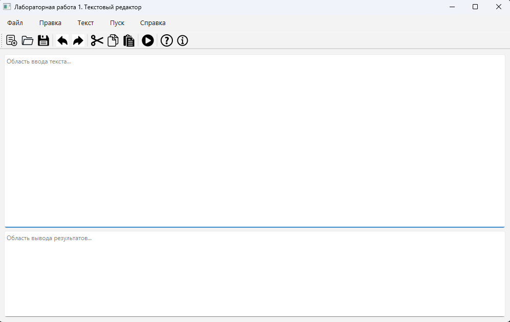
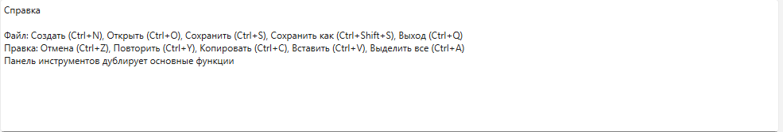
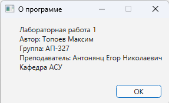

# Лабораторная работа 1: Разработка GUI для языкового процессора

## Этап 3: Добавление панели инструментов и меню "Справка"

### Сведения об авторе
- **Студент:** Топоев Максим
- **Группа:** АП-327
- **Преподаватель:** Антонянц Егор Николаевич, ассистент каф. АСУ
- **Год:** 2026

### Цель этапа
Добавить панель инструментов для быстрого доступа к функциям и реализовать справочную систему.

### Реализовано на предыдущих этапах
- [x] Создано главное окно с базовой разметкой
- [x] Добавлено главное меню (Файл, Правка, Текст, Пуск, Справка)
- [x] Реализованы две текстовые области с возможностью изменения размеров
- [x] Реализовано меню "Файл" (создание, открытие, сохранение)
- [x] Реализовано меню "Правка" (редактирование текста)

### Реализовано на данном этапе
- [x] **Панель инструментов** с кнопками быстрого доступа:
  - Создать, Открыть, Сохранить
  - Отменить, Повторить
  - Вырезать, Копировать, Вставить
  - Пуск (заглушка)
  - Справка, О программе
- [x] **Меню "Справка"**:
  - Вызов справки (F1) - вывод информации в область результатов
  - О программе - информационное окно с данными об авторе
- [x] **Меню "Текст"** - добавлена заглушка
- [x] **Меню "Пуск"** - добавлена заглушка с горячей клавишей F5

### Интерфейс программы

#### Главное меню
- **Файл**: Создать (Ctrl+N), Открыть (Ctrl+O), Сохранить (Ctrl+S), Сохранить как (Ctrl+Shift+S), Выход (Ctrl+Q)
- **Правка**: Отмена (Ctrl+Z), Повторить (Ctrl+Y), Вырезать (Ctrl+X), Копировать (Ctrl+C), Вставить (Ctrl+V), Удалить (Del), Выделить все (Ctrl+A)
- **Текст**: Информация (заглушка)
- **Пуск**: Запуск анализатора (F5) - заглушка
- **Справка**: Вызов справки (F1), О программе

#### Панель инструментов
Панель инструментов содержит кнопки для быстрого доступа к основным функциям программы. Все кнопки дублируют соответствующие пункты меню.

### Скриншоты

#### Главное окно

#### Справка

#### О программе 

### Как запустить
1. Установить Python 3.8+
2. Установить зависимости: `pip install PyQt6`
3. Запустить: `python main.py`

### Текущее состояние
Приложение имеет полностью рабочие меню "Файл", "Правка" и "Справка".
Панель инструментов дублирует основные функции для удобства пользователя.
В окне "О программе" указаны данные автора. Меню "Текст" и "Пуск" пока являются заглушками (будут реализованы в следующих работах).

### Известные ограничения
- Меню "Текст" и "Пуск" являются заглушками
- Подсветка синтаксиса не реализована
- Программа протестирована только на ОС Windows