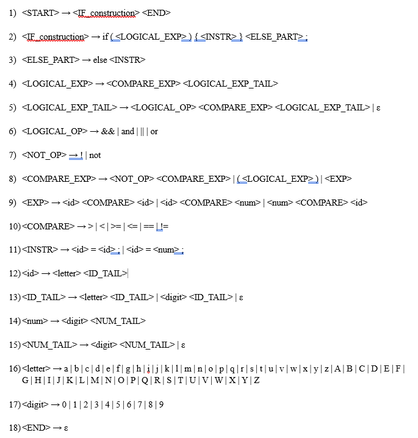
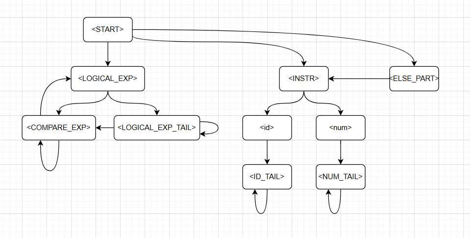
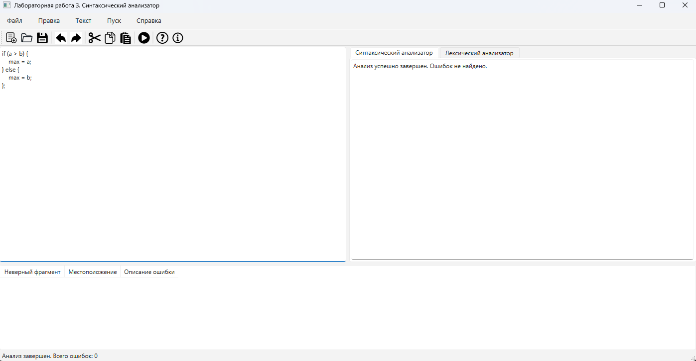
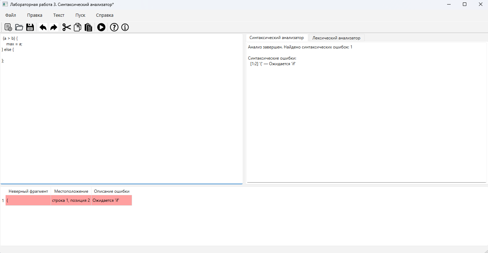
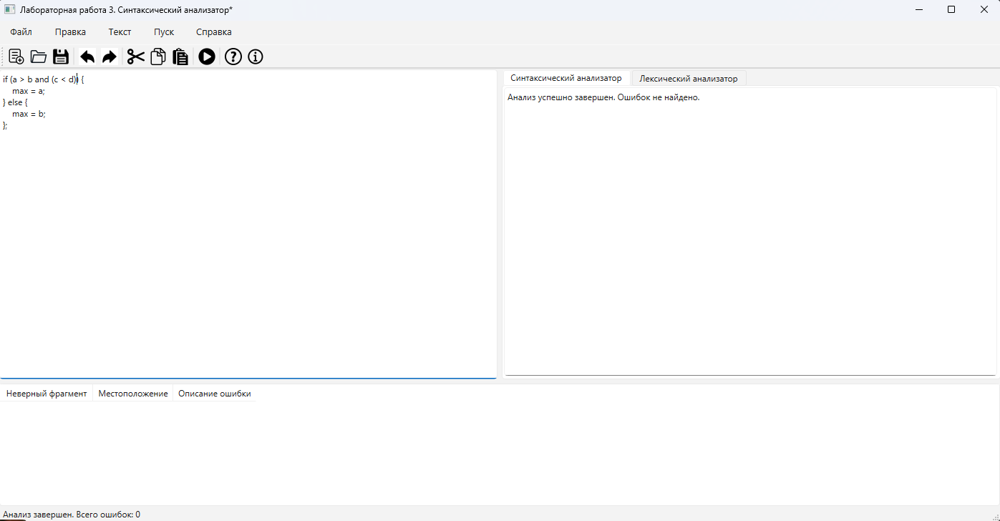
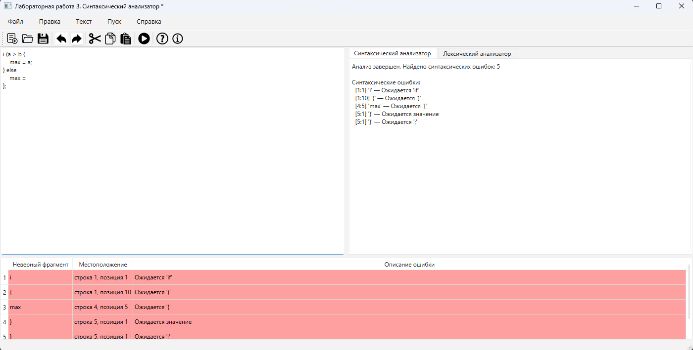

# Лабораторная работа №3: Разработка синтаксического анализатора

## Сведения об авторе
- **Студент:** Топоев Максим
- **Группа:** АП-327
- **Преподаватель:** Антонянц Егор Николаевич, ассистент каф. АСУ
- **Вариант:** 1
- **Год:** 2026

---

## Цель работы
Изучить назначение и принципы работы синтаксического анализатора в структуре компилятора. Спроектировать и программно реализовать парсер для проверки синтаксической правильности входного текста в соответствии с заданной грамматикой. Интегрировать разработанный модуль в графический интерфейс языкового процессора.

---

## Постановка задачи
Разработать синтаксический анализатор для конструкции if-else на Java-подобном языке, который должен:
- Проверять соответствие входной программы заданной грамматике
- Выявлять синтаксические ошибки с указанием их местоположения
- Выполнять восстановление после ошибок для продолжения анализа
- Отображать результаты анализа в табличном виде
- Выводить диагностические сообщения об ошибках

Общие требования:
- Метод анализа: рекурсивный спуск (LL(1)-анализ)
- Восстановление после ошибок: метод Айронса (panic mode)
- Интеграция с GUI, разработанным в лабораторных работах №1-2

---

## Вариант задания
**Вариант 1.** Условный оператор if-else с блоком действий.

### Примеры корректных входных строк

**Пример 1:**
if (a > b) {
max = a;
} else {
max = b;
};

**Пример 2:**
 (a > b) {
    max = a;
} else { };

**Пример 3:**
if (a > b && (c < d)) {
max = a;
} else {
max = b;
}

## Разработка грамматики

### Полное определение грамматики

Грамматика G[START] для конструкции if-else:

Рисунок 1. Грамматика 

### Семантические ограничения
- Запрещено сравнение двух чисел между собой (например, `5 > 3`)
- Ключевое слово `else` обязательно
- Программа должна заканчиваться символом `;`
- Инструкция присваивания должна содержать идентификатор слева от `=`

---

## Классификация грамматики (по Хомскому)

Данная грамматика относится к **типу 2 (контекстно-свободные грамматики)** по классификации Хомского.

**Обоснование:**

1. **Форма правил:** все правила имеют вид A → α, где:
   - A — одиночный нетерминальный символ (левая часть)
   - α — цепочка из терминальных и нетерминальных символов (правая часть)

2. **Отсутствие контекстной зависимости:** нет правил вида αAβ → αγβ, где замена A на γ зависит от окружения α и β.

3. **Наличие рекурсивных правил:**
   - `<LOGICAL_EXP_TAIL>` содержит рекурсивный вызов самого себя
   - `<COMPARE_EXP>` и `<LOGICAL_EXP>` образуют косвенную рекурсию через скобки

4. **Преобразование к LL(1)-виду:**
   - Устранена левая рекурсия в правилах для логических выражений
   - Правила для `<id>` и `<num>` вынесены в отдельные нетерминалы с хвостами

---

## Метод анализа
### Граф рекурсивного спуска

Рисунок 2. Рекурсивный спуск

## Диагностика и нейтрализация синтаксических ошибок

### Метод Айронса (Panic Mode Recovery)

Разрабатываемый синтаксический анализатор построен на базе контекстно-свободной грамматики. При нахождении лексемы, которая не соответствует грамматике предлагается свести алгоритм нейтрализации к последовательному удалению следующего символа во входной цепочке до тех пор, пока следующий символ не окажется одним из допустимых в данный момент разбора.

Схема работы
- Обнаруживается ошибка в лексеме.
- В таблицу ошибок заносится описание ошибки и её позиция.
- Пропускаются символы до тех пор, пока не будет найден ожидаемый символ.
- При нахождении, работа с лексемой продолжается, иначе парсер выводит ошибку об отсутсутствии лексемы и переходит работать со следующей
- Это позволяет за один запуск выявить несколько ошибок во входной строке.

## Тестовые примеры

Рисунок 3. Пример без ошибок

Рисунок 4. Пример с отсутствием ключевого слова

Рисунок 5. Пример с поддержкой логических операций

Рисунок 6. Пример с несколькими ошибками