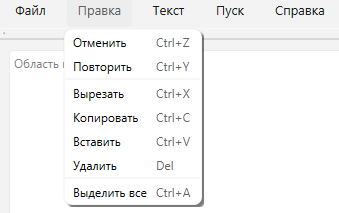
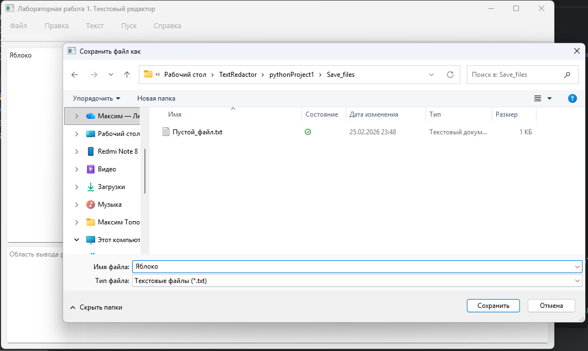
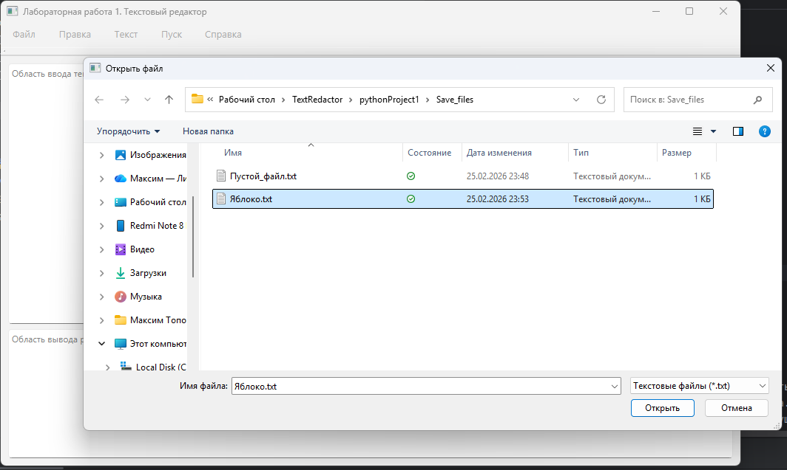

# Лабораторная работа 1: Разработка GUI для языкового процессора

## Этап 2: Реализация меню "Файл" и "Правка"

### Цель этапа
Добавить функционал работы с файлами и редактирования текста.

### Реализовано на предыдущих этапах
- [x] Создано главное окно приложения
- [x] Добавлено главное меню
- [x] Добавлена панель инструментов
- [x] Добавлены две текстовые области
- [x] Реализован QSplitter для изменения размеров областей

### Реализовано на данном этапе
- [x] Меню "Файл":
  - [x] Создать новый файл (Ctrl+N)
  - [x] Открыть файл (Ctrl+O)
  - [x] Сохранить файл (Ctrl+S)
  - [x] Сохранить как (Ctrl+Shift+S)
  - [x] Выход (Ctrl+Q)
- [x] Меню "Правка":
  - [x] Отмена (Ctrl+Z)
  - [x] Повтор (Ctrl+Y)
  - [x] Вырезать (Ctrl+X)
  - [x] Копировать (Ctrl+C)
  - [x] Вставить (Ctrl+V)
  - [x] Удалить (Del)
  - [x] Выделить все (Ctrl+A)

### Скриншоты

#### Файл

#### Правка

#### Сохранение

#### Открытие

### Как запустить
1. Установить Python 3.8+
2. Установить зависимости: `pip install PyQt6`
3. Запустить: `python main.py`

### Текущее состояние
Приложение позволяет создавать, открывать и сохранять текстовые файлы. 
Работают все основные операции редактирования текста. 
Меню "Текст", "Пуск" и "Справка" пока являются заглушками.