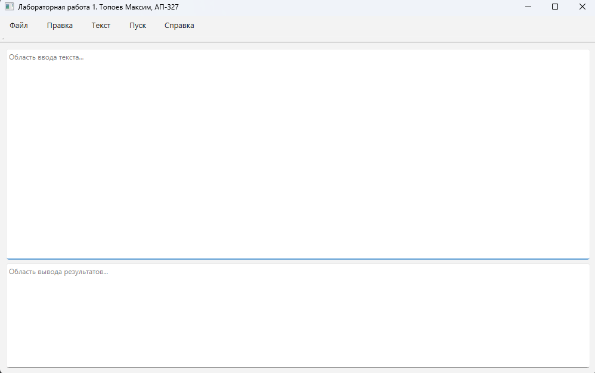

# Лабораторная работа 1: Разработка GUI для языкового процессора

## Этап 1: Создание базового интерфейса

### Цель этапа
Создать главное окно приложения с базовой разметкой: меню, панель инструментов и две текстовые области с возможностью изменения размера.

### Реализовано на данном этапе
- [x] Создано главное окно приложения
- [x] Добавлено главное меню (пункты: Файл, Правка, Текст, Пуск, Справка)
- [x] Добавлена панель инструментов (пока без кнопок)
- [x] Добавлены две текстовые области: редактирования и вывода
- [x] Реализован QSplitter для изменения размеров областей
- [x] Настроена адаптация интерфейса при изменении размера окна

### Скриншоты

### Как запустить
1. Установить Python 3.8+
2. Установить зависимости: `pip install PyQt6`
3. Запустить: `python main.py`

### Текущее состояние
Приложение представляет собой окно с пустыми областями. Функционал меню пока не реализован.