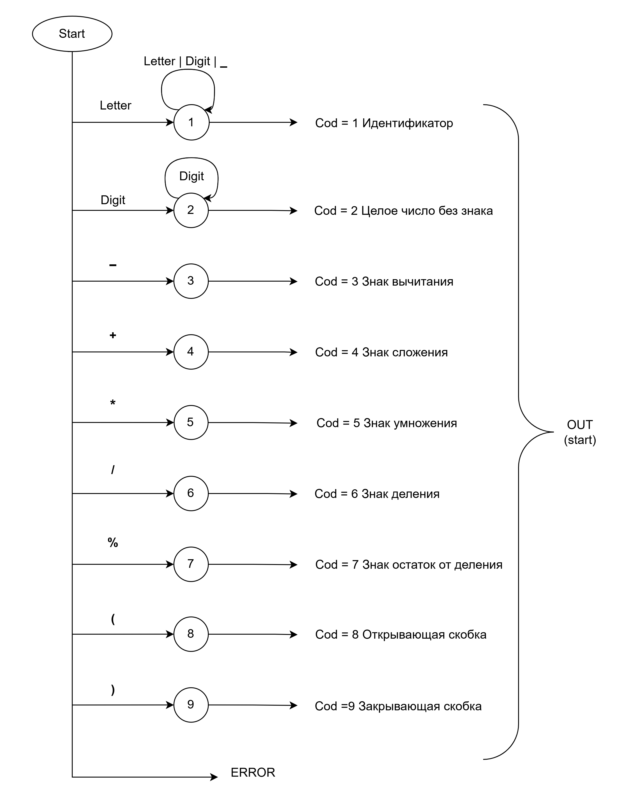
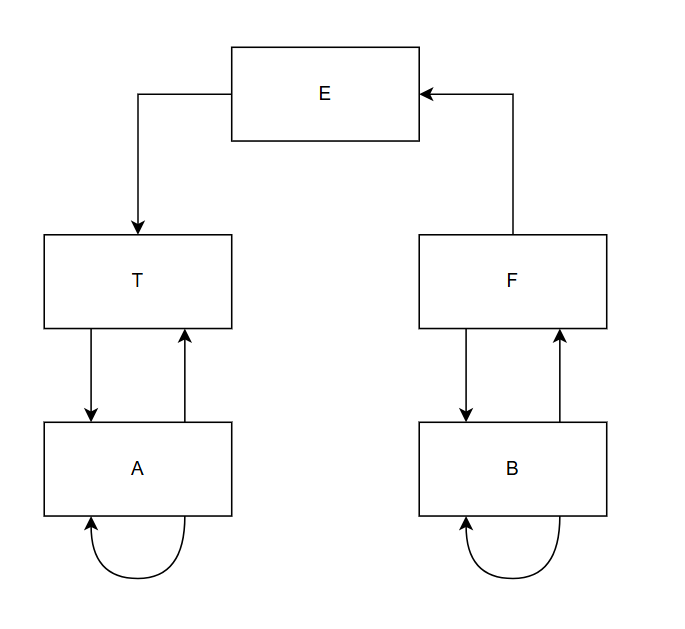
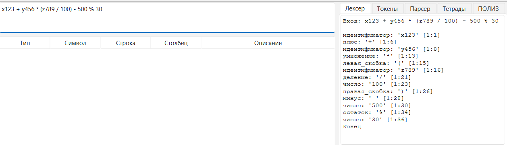
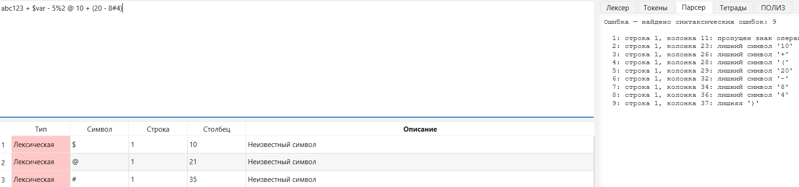
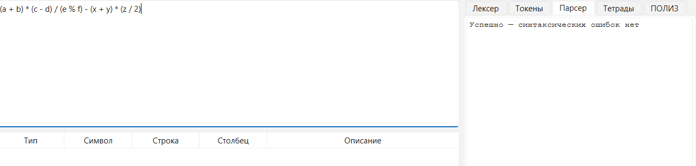
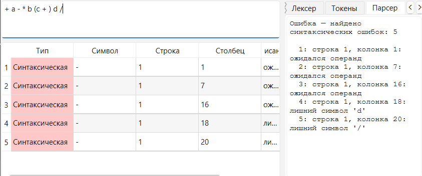
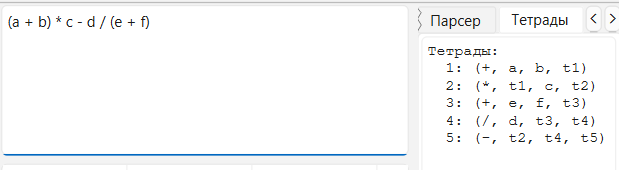
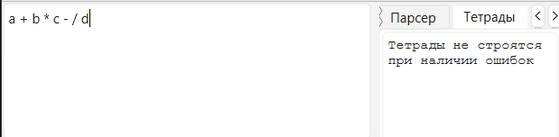
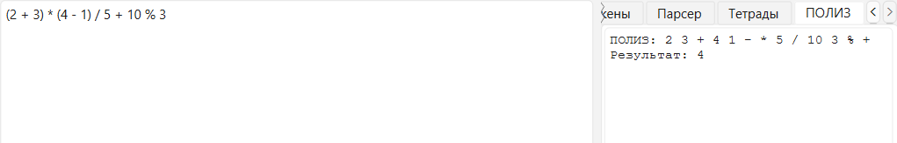
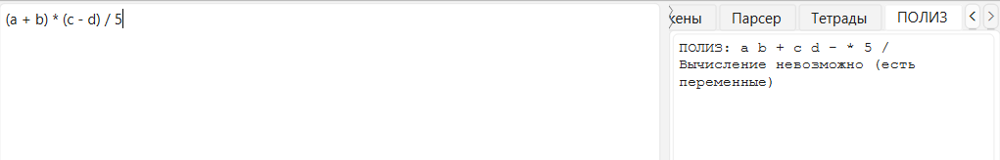

# Лабораторная работа 6: Создание внутренней формы представления программы

## Сведения об авторе
- **Студент:** Топоев Максим
- **Группа:** АП-327
- **Преподаватель:** Антонянц Егор Николаевич, ассистент каф. АСУ
- **Год:** 2026

## Цель работы
Изучить методы построения внутреннего представления программы (ВПП) на основе контекстно-свободной грамматики, реализовать синтаксический анализатор методом рекурсивного спуска и преобразовать арифметические выражения в тетрады и ПОЛИЗ.

Сведения об авторе

Студент: Топоев Максим

Группа: АП-327

## Постановка задачи

1. Реализовать поиск лексических и синтаксических ошибок для заданной КС-грамматики методом рекурсивного спуска.
2. Представить внутреннюю форму программы в виде тетрад (op, arg1, arg2, result) для арифметических выражений (только для корректных строк).
3. Преобразовать выражение в ПОЛИЗ (польскую инверсную запись) и вычислить его значение (только арифметическое выражение из целых чисел).

## Вариант задания

Грамматика арифметических выражений для языков программирования: 11. Java

P: 
```java
    1. E → TA
    2. A → | + TA | - TA
    3. T → FB
    4. B → | * FB | / FB | % FB
    5. F → num |id |(E)
    6. id → letter {letter | digit}
    7. num → digit {digit}
```
Z = E

VT = {a...z...A...Z, 0-9, _, +, -, *, /, %, (, )}

Классификация Хомскомо: контекстно-свободные грамматики: A -> α, A ∊ VN, α ∊ V*

```java
a + b + c * d - e / (f * (g + h))
(1 + 6) - 10 / (11 % 6) + (6 - (7 + 1))
7 + 2 - 8 % ( 9 * 4 - 13) / 5
```

## Диаграмма лексера



Рисунок 1. Диаграмма лексера

## Схема рекурсивного спуска для парсера



Рисунок 2. Схема рекурсивного спуска

## Тестовые примеры

### Тестовые примеры для лексера



Рисунок 3. Пример корректной строки



Рисунок 4. Пример строки с недопустимыми символами

### Тестовые примеры для парсера



Рисунок 5. Пример корректной строки



Рисунок 6. Пример строки с пропущенными знаками и операнд

### Внутренняя форма представления программы (тетрады):



Рисунок 7. Пример корректной строки



Рисунок 8. Пример строки с ошибкой

### ПОЛИЗ



Рисунок 9. Пример корректной строки



Рисунок 10. Пример строки с ошибкой
