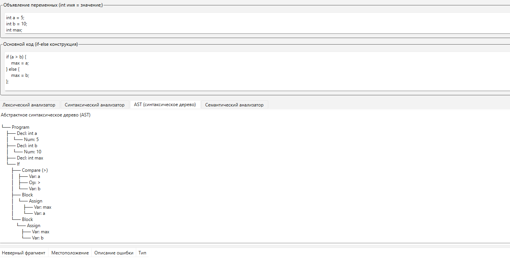
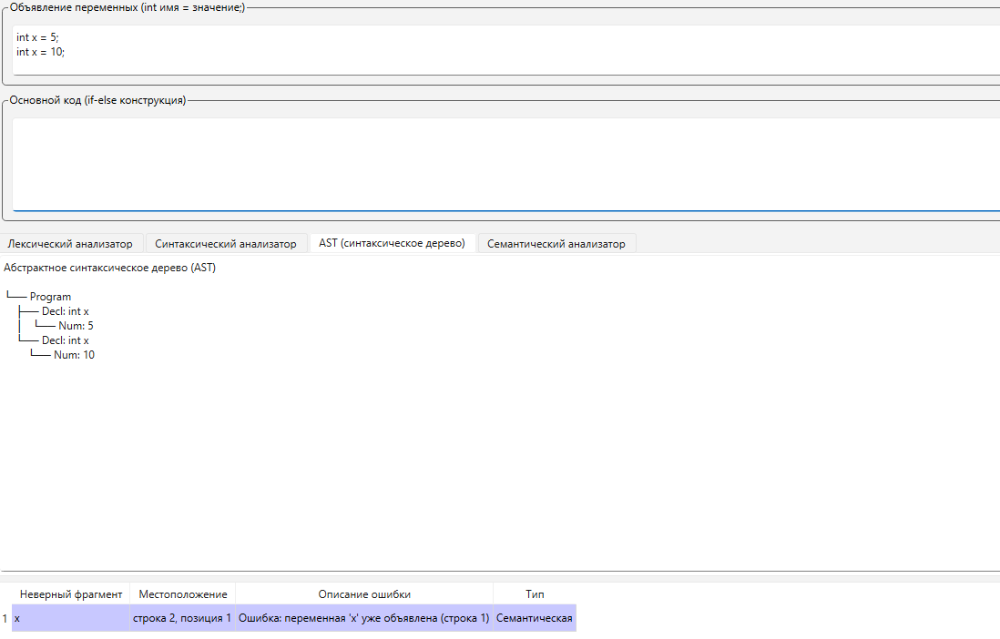
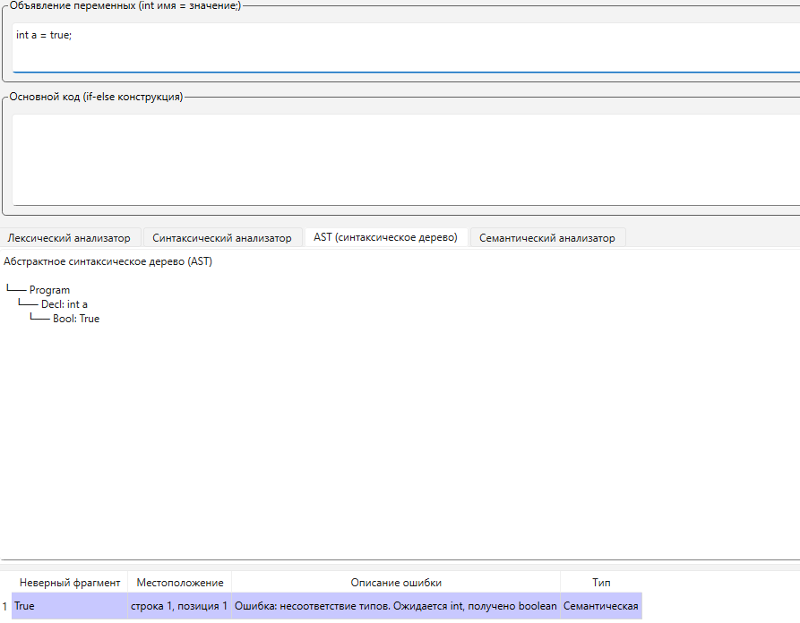
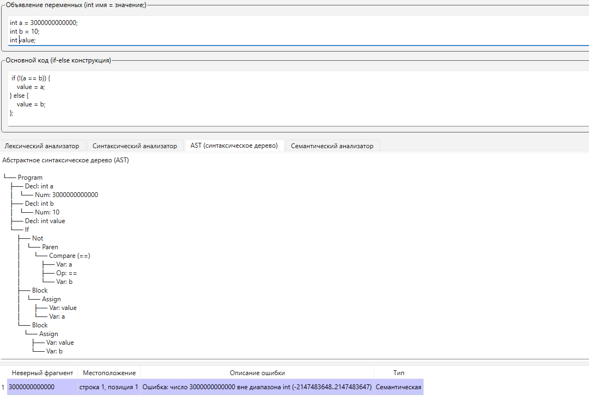
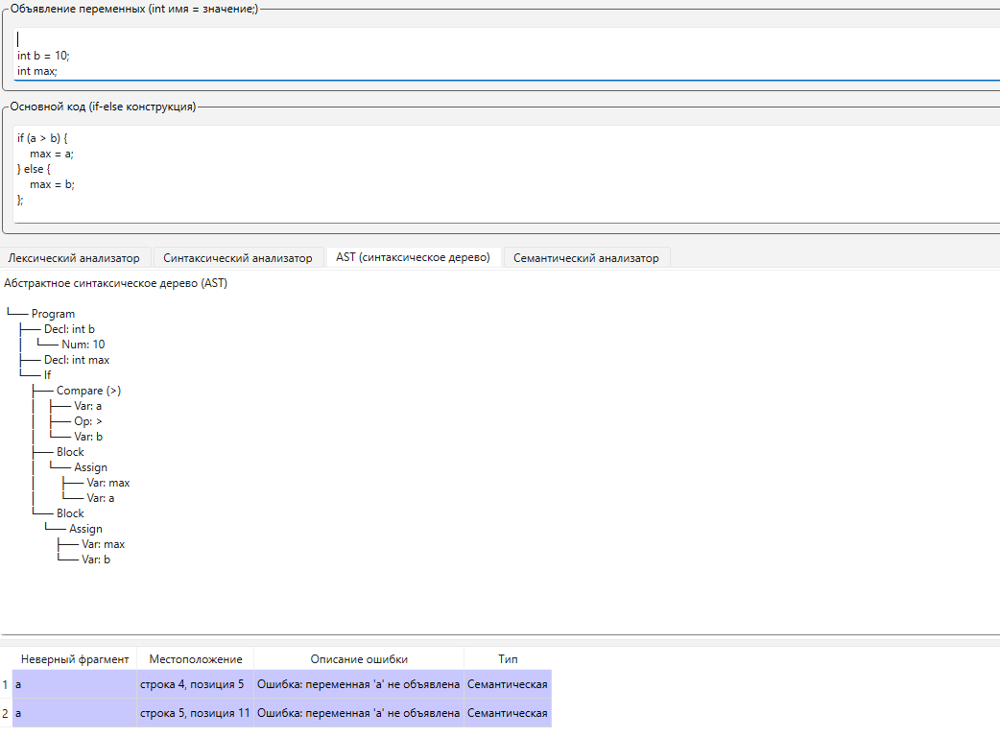

# Лабораторная работа №5: Построение AST и проверка контекстно-зависимых условий

## Сведения об авторе
- **Студент:** Топоев Максим
- **Группа:** АП-327
- **Преподаватель:** Антонянц Егор Николаевич, ассистент каф. АСУ
- **Вариант:** 1 (Условный оператор if-else с блоком действий)
- **Год:** 2026

---

## Вариант задания

### Тема работы
Разработка семантического анализатора: построение абстрактного синтаксического дерева (AST) для конструкции if-else с блоком действий.

### Примеры верных строк
```java
int a = 5;
int b = 10;
int max;
if (a > b) {
    max = a;
} else {
    max = b;
};
```
# Контекстно-зависимые условия
В рамках лабораторной работы реализованы следующие семантические проверки:

## 1. Уникальность идентификаторов
Переменная не может быть объявлена дважды в одной области видимости.

Пример ошибки:
```java
int x = 5;
int x = 10;  // Ошибка: переменная 'x' уже объявлена
```
## 2. Совместимость типов
Тип инициализирующего значения или присваиваемого значения должен соответствовать типу переменной.

Пример ошибки:

```java
int a = true;  // Ошибка: несоответствие типов
```

## 3. Допустимые значения (для типа int)
Числовое значение должно находиться в диапазоне -2,147,483,648 до 2,147,483,647.

Пример ошибки:

```java
int x = 3000000000;  // Ошибка: число вне диапазона int
```
## 4. Использование объявленных идентификаторов
Переменная должна быть объявлена до её использования.

Пример ошибки:

```java
x = 10;  // Ошибка: переменная 'x' не объявлена
```

# Структура AST

## Типы узлов AST
| Класс узла | Назначение                          | Атрибуты                                            |
|------------|-------------------------------------|-----------------------------------------------------|
| Program    | Корневой узел программы             | children (список дочерних узлов)                    |
| Decl       | Объявление переменной               | var_type, name, value                               |
| If         | Условный оператор if-else           | cond (условие), then (блок then), else_ (блок else) |
| Block      | Блок кода { ... }                   | items (список инструкций)                           |      
| Assign     | Присваивание id = value             | left (переменная), right (значение)                 |
| Var        | Переменная (идентификатор)          | name (имя переменной)                               |
| Num        | Числовой литерал                    | value (значение числа)                              |
| Str        | Строковый литерал                   | value                                               |
| Bool       | Логический литерал                  | value                                               | 
| Compare    | Операция сравнения                  | left, op, right                                     |
| Logic      | Логическая операция (&&, and, or)   | left, op, right                                     |
| Not        | Отрицание (!, not)                  | expr (выражение)                                    |
| Op         | Оператор (сравнения или логический) | value (строковое представление оператора)           |
| Paren      | Выражение в скобках                 | expr (вложенное выражение)                          |


Рисунок 1. Рисунок AST для верной строки в draw.io


Рисунок 2. Формат вывода AST в программе.

# Тестовые примеры

### Исходный код
```java
int a = 5;
int b = 10;
int max;
if (a > b) {
    max = a;
} else {
    max = b;
};
```



Рисунок 3. Пример 1

```java
int x = 5;
int x = 10;
```



Рисунок 4. Пример 2

```java
int a = true;
```



Рисунок 5. Пример 3

```java
int a = 3000000000000;
int b = 10;
int value;
 if (!(a == b)) {
    value = a;
} else {
    value = b;
};
```


Рисунок 6. Пример 4

```java
int b = 10;
int max;
if (a > b) {
    max = a;
} else {
    max = b;
};
```


Рисунок 7. Пример 5

# Инструкция по запуску

### Требования
- Python 3.8 или выше
- Библиотека PyQt6

### Установка PyQt6
```
pip install PyQt6
```

### Запуск программы
```
python main.py
```