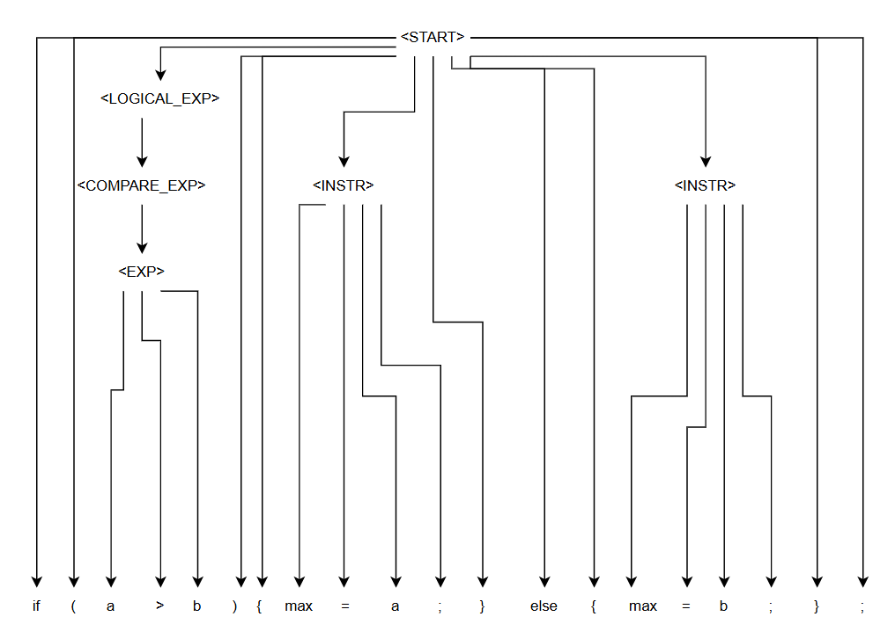
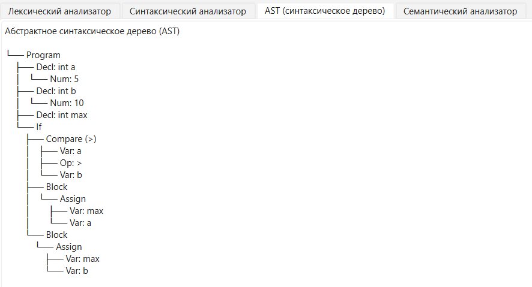
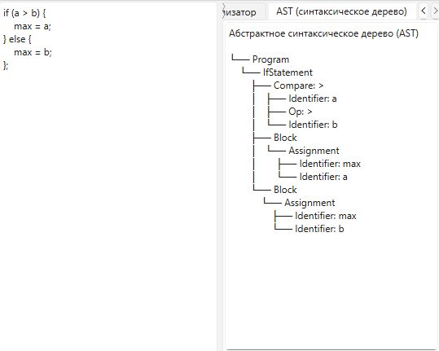
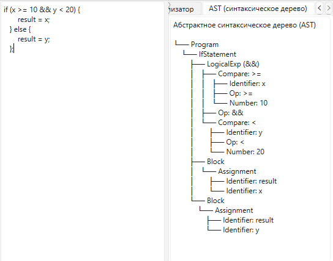
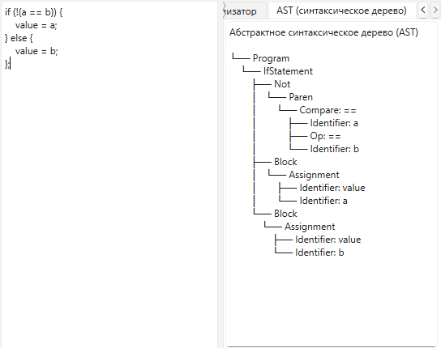

# Лабораторная работа №5: Построение AST и проверка контекстно-зависимых условий

## Сведения об авторе
- **Студент:** Топоев Максим
- **Группа:** АП-327
- **Преподаватель:** Антонянц Егор Николаевич, ассистент каф. АСУ
- **Вариант:** 1 (Условный оператор if-else с блоком действий)
- **Год:** 2026

---

## Вариант задания

### Тема работы
Разработка семантического анализатора: построение абстрактного синтаксического дерева (AST) для конструкции if-else с блоком действий.

### Примеры верных строк
```java
1:
   if (a > b) {
       max = a;
   } else {
       max = b;
   };
2. 
   if (x >= 10 && y < 20) {
       result = x;
   } else {
       result = y;
   };
3. 
   if (!(a == b)) {
       value = a;
   } else {
       value = b;
   };
```
# Контекстно-зависимые условия
Контекстно-зависимые условия (семантические правила) в данной работе не реализованы, так как грамматика языка не содержит:

- Объявлений переменных (нет const, val, let)

- Типов данных (нет Int, String, Boolean)

В рамках данного варианта задания выполнено только построение и визуализация AST.

# Структура AST

## Типы узлов AST
| Класс узла | Назначение                           | Атрибуты                                             |
|------------|--------------------------------------|------------------------------------------------------|
| Program    | Корневой узел программы              | children (список дочерних узлов)                     |
| If         | Условный оператор if-else            | cond (условие), then (блок then), else_ (блок else)  |
| Block      | Блок кода { ... }                    | items (список инструкций)                            |      
| Assign     | Присваивание id = value              | left (переменная), right (значение)                  |
| Var        | Переменная (идентификатор)           | name (имя переменной)                                |
| Num        | Числовой литерал                     | value (значение числа)                               | 
| Compare    | Операция сравнения                   | left, op, right                                      |
| Logic      | Логическая операция (&&, and, or)    | left, op, right                                      |
| Not        | Отрицание (!, not)                   | expr (выражение)                                     |
| Op         | Оператор (сравнения или логический)  | value (строковое представление оператора)            |
| Paren      | Выражение в скобках                  | expr (вложенное выражение)                           |



Рисунок 1. Рисунок CST / AST для верной строки в draw.io



Рисунок 2. Формат вывода AST в программе.

# Тестовые примеры

### Исходный код
```java
if (a > b) {
    max = a;
} else {
    max = b;
};
```



Рисунок 3. Пример 1

```java
if (x >= 10 && y < 20) {
       result = x;
   } else {
       result = y;
   };
```



Рисунок 4. Пример 2

```java
if (!(a == b)) {
    value = a;
} else {
    value = b;
};
```



Рисунок 5. Пример 3

# Инструкция по запуску

### Требования
- Python 3.8 или выше
- Библиотека PyQt6

### Установка PyQt6
```
pip install PyQt6
```

### Запуск программы
```
python main.py
```